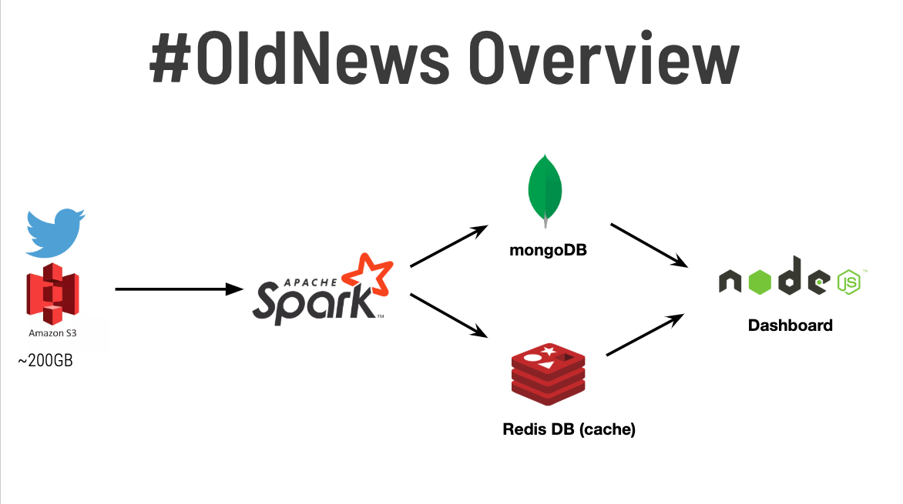
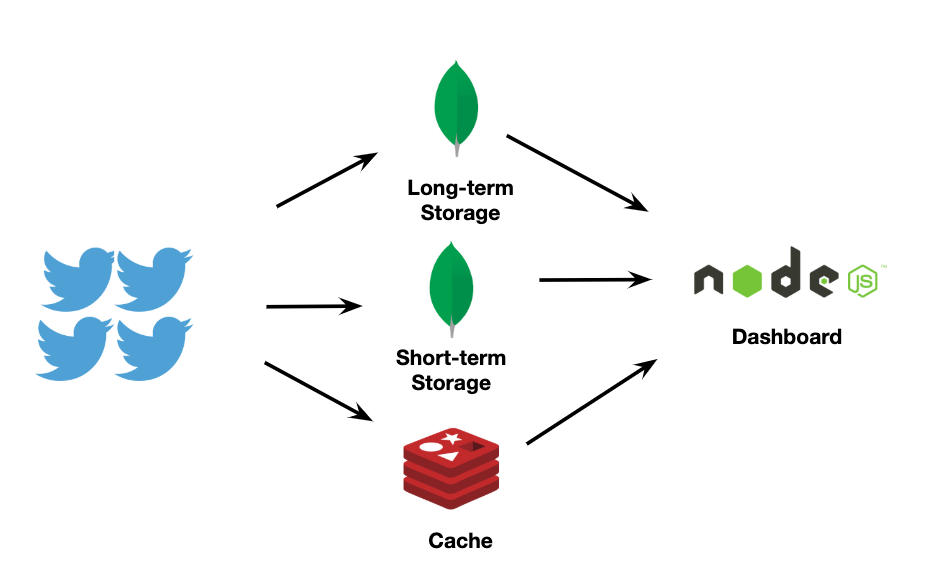

# Motivation

The motivation between #OldNews began with this question.  How can businesses prevent releasing a product or an advertisement that will hit the market too late?

Of course, there are an infinite number of ways this question can be tackled. Entire industries exist to measure the increase or decrease of trends. How can a trend even be measured? Is it the most popular hashtag on Instagram, or the most liked post?  Is it the most viewed video on Youtube, or the one that was the most shared?

It would be foolish to try and tackle all of these things at once, but I sought to seek a common thread.  A realization I eventually had was that effectively analyzing trends depended upon effectively analyzing different time scales.  A trend can seem to be going up in the last day or week when it has in fact been decreasing for months.  Or a trend can come back in multi-year cycles and what was old can become new again (ie Stranger Things and the resurgence of 1980s culture). 

From this through process, the goal #OldNews became to build a database architecture that could effectively store and query multiple years or even decades worth of data.  

# Architecture and Implementation

### Inspiration

Many of the concepts for #OldNews were inspired by the methods used by Netflix and their viewer data.  The full implementation of Netflixes' methods are largely beyond the scope of  4-week project, but I tried to include as many of the concepts as possible.

- [https://netflixtechblog.com/scaling-time-series-data-storage-part-i-ec2b6d44ba39](https://netflixtechblog.com/scaling-time-series-data-storage-part-i-ec2b6d44ba39)
- [https://netflixtechblog.com/scaling-time-series-data-storage-part-ii-d67939655586](https://netflixtechblog.com/scaling-time-series-data-storage-part-ii-d67939655586)


### Overview of Tech Stack


As we see in the overview #OldNews begins with archived Twitter data being loaded from an S3 bucket. In this proof-of-concept, I used an archive dataset that is described in more detail below, but in a future iteration #OldNews could easily be integrated with Spark Stream to allow for real-time data processing. From the S3 bucket, the data is extracted and transformed and loaded into MongoDB and a Redis cache through Apache Spark.  The MongoDB and Redis cache are queried through a NodeDB frontend. The 2 databases are actually designed to be loaded and queried in 3 stages, which is described in more detail in the following diagram.



First, the largest database is the long-term MongoDB that stores all data for all hashtags going back in history. This database uses a highly efficient compression methods to scale well, allowing #OldNews to be effective and reponsive for years or even  decades worth of data. Since the database is stored on disk, this layer of #OldNews will horizonally scale well with partition tolerence and eventual consistency.

Second, there is a second MongoDB that is designed to store short-term hashtag data for all hashtags that have occured in the past 7 days. This is essentially a 'cache' on disk for more recent data that will likely be queried more frequently (ie. What are trends that are popular now vs trends that used to be popular 5 years ago?).  The data is stored in an uncompressed format, allowing for faster queries, and horizontal scaling. 

Third, there is a Redis cache that stores the past day's hashtags. This allows for very fast (< 5 ms) response time to queries. But since this is a cache in memory, Redis will not scale as well as MongoDB, although Amazon RDS allows for the spinning up of larger EC2 instances to scale vertically (for a price, of course).


### A Deeper Dive

### The Dataset

#OldNews in its current iteration uses 2 months of Twitter archive data from ([https://archive.org/details/twitterstream](https://archive.org/details/twitterstream)). The data is decompressed from the original bz2.tar format and consolidated using a python script called Decompress_And_Combine.py found in the ETL folder.

### Apache Spark

Apache Spark is an open-source distributed general-purpose cluster-computing framework. Spark provides an interface for programming entire clusters with implicit data parallelism and fault tolerance.

The Spark script used to do most of the processing is spark_submit_mongo.py in the ETL directory. The script speeds things up by extracting the Hashtags from the entities field of the original Twitter data rather than processing and tokenizing the tweet text itself.


#### Outline of Extraction and Processing of Twitter Data

* First the JSON files are read into the Spark context using the read.json() command.
* Only the fields that describe the hashtag (in a separate field from the tweet itself), the language of the tweet and the 'created_at' field are extracted from each tweet. At this point, each entry will look like this:

```
+-------------------+--------------------+----+-----------------------+
|                 id|          created_at|lang|               hashtags|
+-------------------+--------------------+----+-----------------------+
|1164062385805692929|Wed Aug 21 06:31:...|  en|    [[[0, 8], FibDems]]|
|1164062394185854976|Wed Aug 21 06:31:...|  en|   [[[64, 69], rain]...|
|1164063061071712256|Wed Aug 21 06:33:...|  en|   [[[88, 110], Huma...|
|1164063342069276672|Wed Aug 21 06:35:...|  en|   [[[46, 67], Stopk...|
|1164063551788441600|Wed Aug 21 06:35:...|  en|   [[[60, 75], 48MPA...|
....
```

* Next we use the 'explode' function so that each hashtag gets its own entry in the table. You'll notice there are two entries for the hashtag #rain on Aug 21st. That's great. This is what #OldNews is eventually going to count. 

```
+--------------------+--------------------+
|          created_at|                 col|
+--------------------+--------------------+
|Wed Aug 21 06:31:...|   [[0, 8], FibDems]|
|Wed Aug 21 06:31:...|    [[64, 69], rain]|
|Wed Aug 21 06:31:...|    [[70, 75], rain]|
|Wed Aug 21 06:31:...|   [[76, 82], radar]|
|Wed Aug 21 06:33:...|[[88, 110], Human...|
|Wed Aug 21 06:33:...|[[112, 121], Poac...|
|Wed Aug 21 06:35:...|[[46, 67], Stopki...|
|Wed Aug 21 06:35:...|[[60, 75], 48MPAn...|
|Wed Aug 21 06:35:...|    [[76, 81], MiA3]|
```

* But before we do that, we first clean up our table by dropping columns we don't want, and format the created_at field so it considers all the occurances of hashtags that occur during each hour. 

```
>> > HashTagsTable_WithDates.show(10)
+--------------------+--------------+
|             Keyword | Time|
+--------------------+--------------+
|             FibDems | 2019-8-21 6: 00|
|                rain | 2019-8-21 6: 00|
|                rain | 2019-8-21 6: 00|
|               radar | 2019-8-21 6: 00|
```

* Finally we do a groupBy() command to count the tweets that occur in each hour-long time block. This is what will be added to the mongo database and cache.

### MongoDB

MongoDB is a cross-platform document-oriented database that is classefied as a NoSQL. MongoDB uses JSON-like documents with schema.

For #OldNews, MongoDB was chosen over SQL databases for a few reasons.  The first reason had to do with the fact that I wanted each hashtag to be an entry, and for the entry to be updated as more data was streamed in. In an SQL database this would require the entire entry to be loaded and updated with each new occurance of the hashtag, or even worse, require columns to be added to the database with each new occurance. Using a NoSQL database like MongoDB simplified this entire process, since documents could be 'upserted' (update-insert), and an entry could have an indefinite number of entries.

In addition, MongoDB allows for the compression of the DB using zlib (similar to gzip), which offer excellent compression, but more resource intensive than the default Snappy method.

For #OldNews, I created two MongoDBs (collections) using the following commands. One with zlib compression and one with no compression:

```
    db.createCollection( "tweets_final_zlib", {storageEngine:{wiredTiger:{configString:'block_compressor=zlib'}}} );
    db.createCollection( "tweets_final_uncompressed", {storageEngine:{wiredTiger:{configString:'block_compressor=none'}}} );
```

Using this 2-tiered database architeture allowed for a < 20 ms response for the uncompressed database that did not require a decompression step after each query. For the full compressed db, queries were still a zippy < 100 ms, even with the decompression step with zlib.

For more information about MongoDBs compression features, here is a great article. 

[Compression Options for MongoDB](https://www.mongodb.com/blog/post/new-compression-options-mongodb-30)

### Redis

Redis, which stands for Remote Dictionary Server, is a fast, open-source, in-memory key-value data store for use as a database, cache, message broker, and queue. Using Redis with #OldNews allowed for very fast < 5ms response time for queries of recent data.  Redis was integrated into #OldNews using Amazon RDS, so there was no separate set-up of an EC2 instance. 
